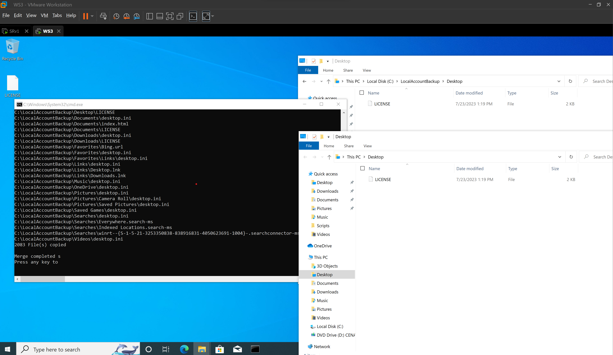

# TechTaskFlow - Local Account Backup and Domain Join Script

## Overview:
TechTaskFlow is a script designed to streamline the process of backing up a local user's home folder and joining a domain. The script requires administrator privileges to execute successfully.

## Features:

- Backup local user's home folder to a specified destination folder.
- Join a domain using provided credentials (local and domain admin credentials).
- Register DNS and verify domain connectivity.
- Generate a log file for recording script output and events.

## Usage:

1. Run the script with administrator privileges.
2. Enter the local username for whom you want to back up the home folder.
3. The script will create a backup folder (C:\LocalAccountBackup) if it doesn't exist and copy the user's home folder there using xcopy.
4. You will be prompted to enter the domain name and verify the IP address configuration.
5. If everything is correct, the script will attempt to join the specified domain using provided credentials (domain and local admin credentials).
6. The script will also perform DNS registration, IP release, renewal, and DNS flush.
7. The script will display the log file location.
## Screenshots:

## Log File:

A log file named "script_log.txt" will be generated in the same directory as the script. It will record the output and events during the script execution.

## Notes:

- Ensure you have administrator privileges before running the script.
- Make sure the source folder (local user's home folder) and destination folder (C:\LocalAccountBackup) exist before running the script.
- The script will display the user's home folder and backup folder contents on the command prompt.
- The log file will be generated or cleared each time the script is executed.

## Contact:

If you have any questions or suggestions, feel free to contact the script author at vince.dev@icloud.com.

## Disclaimer:

This script is provided as-is, and the author takes no responsibility for any data loss or damage caused by its usage. It is recommended to test the script in a non-production environment before using it in a production setup. Always ensure you have backups of critical data before making any significant changes.